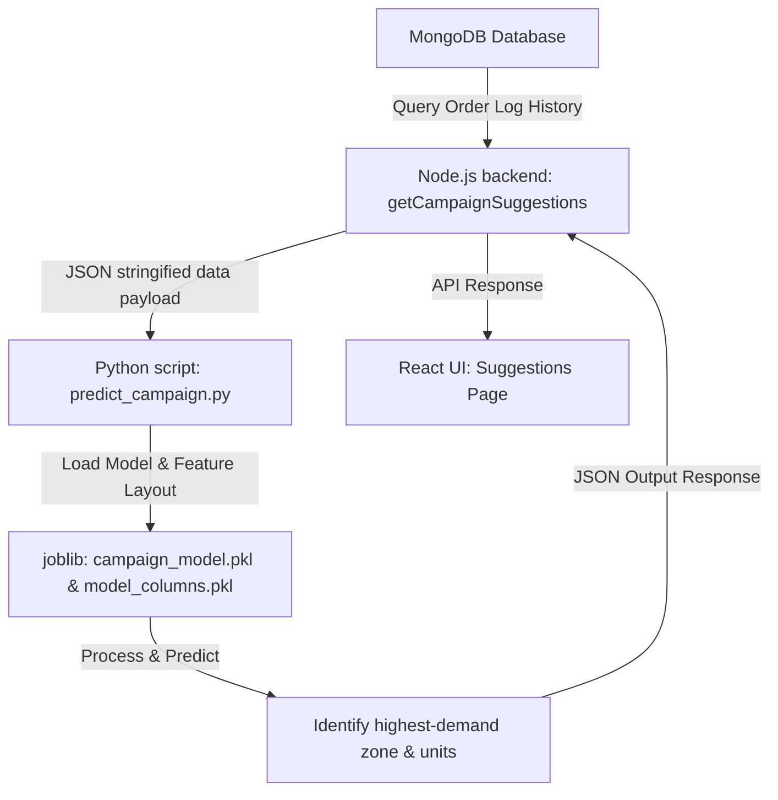

# 🩸 BloodLink: Intelligent Blood Bank & Supply Chain Management System

BloodLink is an end-to-end digital logistics and matching platform designed to bridge the critical gap between hospitals and blood banks. By leveraging real-time inventory tracking, geo-distance routing, secure document verification, integrated digital payments, and a predictive AI engine for targeted blood donation campaigns, BloodLink streamlines blood banking operations to save lives.

---

## 📌 Table of Contents
1. [🚨 Problem Statement](#-problem-statement)
2. [💡 Proposed Solution & Features](#-proposed-solution--features)
3. [✨ Key Benefits](#-key-benefits)
4. [🧠 Smart AI Integration (Campaign Prediction)](#-smart-ai-integration-campaign-prediction)
5. [🛠️ Technology Stack](#%EF%B8%8F-technology-stack)
6. [📂 Directory Structure](#-directory-structure)
7. [⚙️ Installation & Setup Guide](#%EF%B8%8F-installation--setup-guide)
8. [🔌 API Endpoints](#-api-endpoints)
9. [💾 Database Schemas](#-database-schemas)
10. [👥 Contributors](#-contributors)

---

## 🚨 Problem Statement

Every year, millions of lives are put at risk due to inefficiencies in the blood supply chain. The primary challenges in contemporary blood bank systems include:
*   **Information Asymmetry:** Hospitals face major delays finding specific blood types during emergencies, often contacting blood banks individually to check availability.
*   **Wastage & Spoilage:** Blood is a perishable resource with a shelf life of only 35 to 42 days. Lack of coordination leads to over-accumulation in some areas and severe shortages in others.
*   **Geographical Obstacles:** Hospitals lack tools to automatically discover and rank the nearest blood banks based on real-time travel distances.
*   **Reactive Campaigning:** Blood donation camps are often organized randomly without analyzing historic data, leading to low turnout of high-demand blood types or camps set up in regions with low demand.
*   **Manual Friction:** Verification of clinical approvals, manual billing, and tracking invoices lead to administrative overhead and slow delivery.

---

## 💡 Proposed Solution & Features

BloodLink resolves these challenges through a unified platform featuring two distinct portal views (Hospitals & Blood Banks):

### For Hospitals
*   **Live Discovery & Routing:** Automatically lists and sorts blood banks by proximity using the Haversine formula and deterministic coordinates.
*   **Digital Ordering & Verification:** Place blood orders by filling in patient details and uploading official doctor approval certificates (stored securely on Cloudinary).
*   **Seamless Payments:** Integrated Razorpay checkout flow with automated invoice creation and PDF generation using jsPDF.
*   **Request Logs & Analytics:** Interactive history logs and analytics showing usage trends.

### For Blood Banks
*   **Real-time Inventory Management:** Update and track unit counts for all major blood groups (A+, A-, B+, B-, AB+, AB-, O+, O-).
*   **Central Dispatch Dashboard:** Single panel to approve or reject pending requests, which automatically sends custom transactional email notifications to hospitals.
*   **Smart AI Campaign Suggestions:** One-click ML model execution that recommends optimal target locations and blood groups for organizing donation camps.
*   **Campaign Management:** Organize and publicize blood donation drives.

---

## ✨ Key Benefits

| Feature | Hospital Benefit | Blood Bank Benefit | Patient Benefit |
| :--- | :--- | :--- | :--- |
| **Real-time Inventory** | Immediate matching during emergencies. | Automated logging; eliminates phone inquiries. | Faster access to critical blood. |
| **Distance-Based Routing** | Orders placed to nearest available bank. | Efficient regional distribution. | Minimized delivery delays. |
| **Predictive AI Engine** | Reduced supply chain shortages. | Highly efficient campaign allocation. | Higher availability of rare blood types. |
| **Digital Payments & PDFs** | Quick online checkouts and receipts. | Automated billing and ledger tracking. | Zero friction at critical moments. |

---

## 🧠 Smart AI Integration (Campaign Prediction)

BloodLink incorporates a Machine Learning module to predict blood demand and recommend locations for blood donation drives.

### How the AI Pipeline Works:
1.  **Data Collection & Aggregation:** The Node.js controller [orderController.js](file:///c:/Users/Yash%20K/Desktop/final%20sy-c%20blood%20bank%20project%20-%20Copy%20%282%29/server/controllers/orderController.js) queries all order logs from MongoDB. It compiles a structured dataset detailing approved and pending requests grouped by **Location** and **Blood Group**.
2.  **Model Execution:** Node.js spawns a Python subprocess running the script [predict_campaign.py](file:///c:/Users/Yash%20K/Desktop/final%20sy-c%20blood%20bank%20project%20-%20Copy%20%282%29/server/ml_models/predict_campaign.py), passing the aggregated JSON payload.
3.  **Machine Learning Inference:** The Python script loads:
    *   `campaign_model.pkl` (a pre-trained predictive regressor model).
    *   `model_columns.pkl` (ensures matching feature alignment).
    *   It applies one-hot encoding, aligns the feature space, and runs predictions to estimate the `Predicted_Units_Needed` for each location.
4.  **Recommendations Delivery:** The location and blood group with the highest predicted demand is sent back as JSON to the React frontend [Suggestions.jsx](file:///c:/Users/Yash%20K/Desktop/final%20sy-c%20blood%20bank%20project%20-%20Copy%20%282%29/client/src/pages/Suggestions.jsx), allowing managers to organize blood drives where they will have the maximum impact.



---

## 🛠️ Technology Stack

*   **Frontend:** React (Vite), React Router (v7), Tailwind CSS, Axios, Lucide React, Bootstrap Icons.
*   **Backend:** Node.js, Express.js, Express-Session, EJS (views template).
*   **Database:** MongoDB Atlas (Mongoose ODM).
*   **Machine Learning (AI):** Python 3, Pandas, Joblib, Scikit-learn.
*   **Integrations:** 
    *   **Razorpay:** Secure payment processing.
    *   **Cloudinary:** Cloud-based hospital certificate asset management.
    *   **Nodemailer:** Automated transactional email updates.
    *   **jsPDF:** Clientside PDF bill generator.

---

## 📂 Directory Structure

```text
├── client/                      # Frontend Vite + React project
│   ├── src/
│   │   ├── components/          # Reusable UI components (Navbar, etc.)
│   │   ├── context/             # React Context for Global User State (UserContext.jsx)
│   │   ├── pages/               # Page Components (Dashboard, Billing, Suggestions, etc.)
│   │   ├── App.jsx              # Main Client Router & Guard Rules
│   │   └── main.jsx             # React DOM Entrypoint
│   ├── index.html
│   ├── tailwind.config.js
│   ├── vite.config.js
│   └── package.json
│
├── server/                      # Backend Node.js + Express API
│   ├── config/                  # Database connections config (db.js)
│   ├── controllers/             # Business Logic Handlers (auth, billing, order, etc.)
│   ├── middleware/              # Route authentications & upload controllers
│   ├── ml_models/               # Python ML code & Pickled models (campaign_model.pkl)
│   ├── models/                  # Mongoose MongoDB Data Schemas
│   ├── routes/                  # Express Routing tables mapping endpoints
│   ├── uploads/                 # Local fallbacks for uploaded hospital documents
│   ├── mailer.js                # Nodemailer setup for sending transactional emails
│   ├── server.js                # Core Express API entrypoint
│   └── package.json
│
├── .env                         # Server environment configuration keys
├── package.json                 # Root script runner config
└── README.md                    # System Documentation
```

---

## ⚙️ Installation & Setup Guide

Follow these steps to run BloodLink on your local machine.

### Prerequisites
*   [Node.js](https://nodejs.org/) (v16+ recommended)
*   [Python 3.x](https://www.python.org/downloads/) (with pip)
*   [MongoDB Atlas](https://www.mongodb.com/cloud/atlas) account (or local MongoDB server)

---

### Step 1: Clone the Project
Open your terminal and clone the repository, then navigate into the root directory:
```bash
git clone <repository-url>
cd "final sy-c blood bank project - Copy (2)"
```

---

### Step 2: Configure Environment Variables
Create a file named `.env` in the **root directory** and configure the variables as shown below:
```env
PORT=3000
MONGODB_URI=your_mongodb_connection_string

# Razorpay credentials
RAZORPAY_KEY_ID=your_razorpay_key_id
RAZORPAY_KEY_SECRET=your_razorpay_key_secret

# Cloudinary configurations
CLOUDINARY_CLOUD_NAME=your_cloudinary_cloud_name
CLOUDINARY_API_KEY=your_cloudinary_api_key
CLOUDINARY_API_SECRET=your_cloudinary_api_secret

# Optional parameters
FRONTEND_URL=http://localhost:5173
```

---

### Step 3: Install Backend Dependencies
From the project root, run:
```bash
npm install
```
Then navigate to the `server/` directory and install the server packages:
```bash
cd server
npm install
cd ..
```

---

### Step 4: Setup Python Environment
To run the ML predictive AI, you must install the required Python libraries.
```bash
pip install pandas joblib scikit-learn
```
*Note: Make sure your `python` command is added to your system's PATH variables so the Node.js backend can spawn the script.*

---

### Step 5: Install Frontend Dependencies
Navigate to the `client/` directory and install the packages:
```bash
cd client
npm install
cd ..
```

---

### Step 6: Start the Application

You can run both servers concurrently for development:

1.  **Start the Backend Server (Port 3000):**
    From the root folder, run:
    ```bash
    npm run dev
    ```
    This starts the Node server running on [http://localhost:3000](http://localhost:3000).

2.  **Start the Frontend Server (Port 5173):**
    Open a new terminal window, navigate to the `client` directory, and start Vite:
    ```bash
    cd client
    npm run dev
    ```
    This runs the client app on [http://localhost:5173](http://localhost:5173) with Hot Module Replacement.

---

## 🔌 API Endpoints

### 🔑 Authentication Routes
*   `POST /register` - Register a new user (Hospital / Blood Bank).
*   `POST /login` - Log in to the application.
*   `GET /logout` - Log out and clear the session.
*   `POST /forgot-password` - Request password reset token.
*   `POST /reset-password/:token` - Update password.

### 🩸 Orders & Logistics
*   `POST /order` - Place a new blood order (attaches approval documents via Cloudinary/Multer).
*   `POST /check-availability` - Query blood bank inventories sorted by real-time distance using address coordinates.
*   `GET /dashboard-requests` - Fetch pending orders for the logged-in blood bank.
*   `POST /approve-request/:id` - Approve a blood order, deducts stock, and sends email notifications.

### 🧠 Smart AI Engine
*   `GET /api/campaign-suggestions` - Aggregates order metrics and spawns the Python ML model to return target locations.

### 💳 Billing & Invoices
*   `POST /api/bills` - Creates a Razorpay order.
*   `POST /api/bills/verify` - Verifies Razorpay signatures and updates invoice statuses.

---

## 💾 Database Schemas

BloodLink stores relational data inside Mongo using Mongoose models:

### 1. User Schema (`User.js`)
Stores authentication metadata, license credentials, and stock volumes.
```javascript
{
  type: String,                    // "hospital" or "bloodbank"
  name: String,
  email: { type: String, unique: true },
  password: String,
  address: String,
  licenseNumber: { type: String, unique: true },
  status: { type: String, default: 'under review' }, // admin review
  inventory: {
    type: Map,
    of: Number,                    // Key: Blood Group (e.g. "O+"), Value: Units Count
  }
}
```

### 2. Order Schema (`Order.js`)
Tracks the logistics transaction between a hospital and blood bank.
```javascript
{
  hospitalName: String,
  bankId: String,                  // Mapped Blood Bank reference
  hospitalEmail: String,
  bloodGroup: String,
  units: Number,
  patientName: String,
  date: { type: Date, default: Date.now },
  status: { type: String, default: 'Pending' }, // "Pending" or "Approved"
  paymentStatus: { type: String, default: 'Unpaid' }, // "Unpaid" or "Paid"
  documentPath: String,            // Cloudinary URL for approval files
  isDirect: Boolean                // Order direct dispatch flag
}
```

### 3. Campaign Schema (`Campaign.js`)
Holds schedule details for scheduled blood donation events.
```javascript
{
  organizerName: String,
  location: String,
  startDate: Date,
  endDate: Date,
  contact: String,                 // Phone number or Email address
  details: String,                 // Event specifications
  createdAt: { type: Date, default: Date.now }
}
```

---

## 👥 Contributors

This project was built and is maintained by:
*   **Yash Kodgirwar**
*   **Vivek Joshi**
*   **Mohan**
*   **Yash Thokal**
